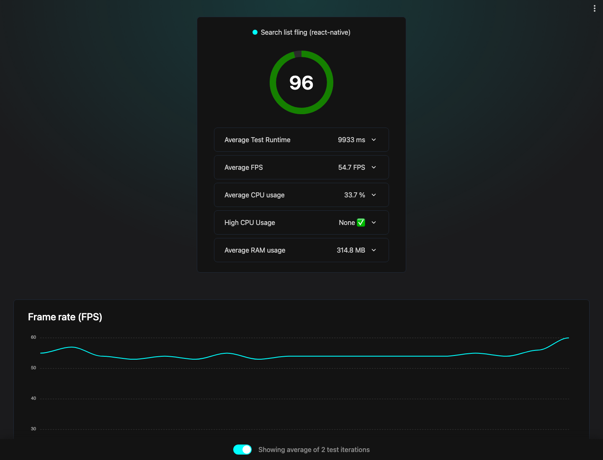
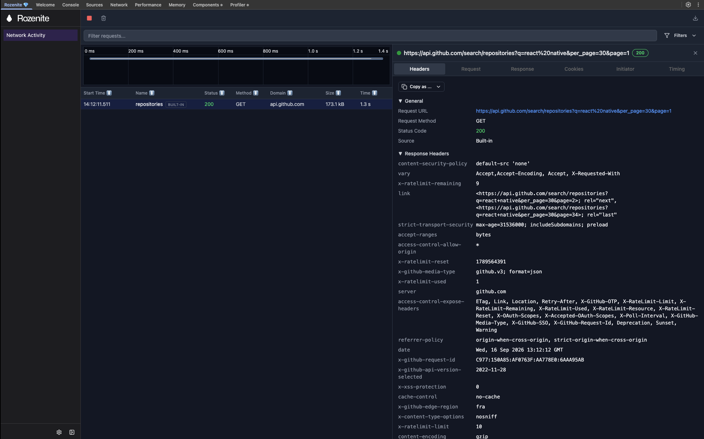
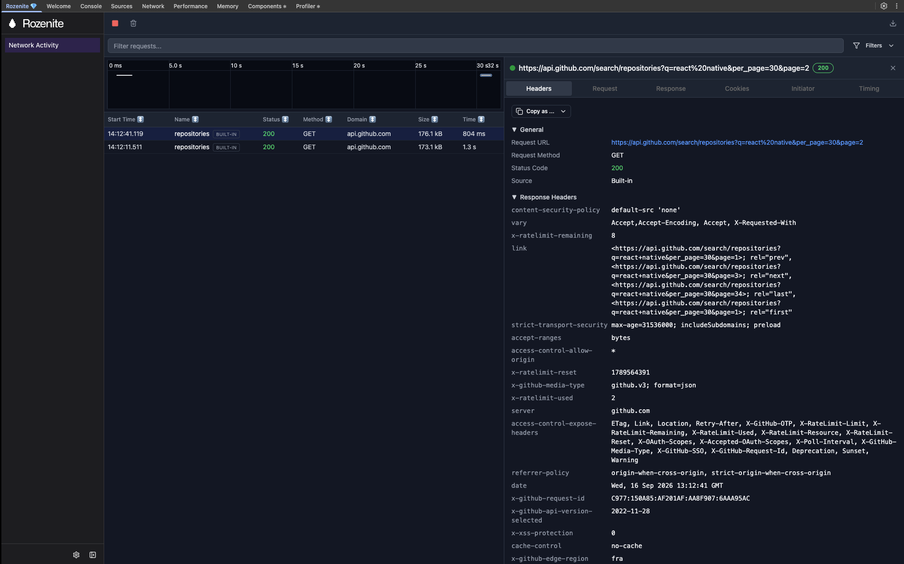
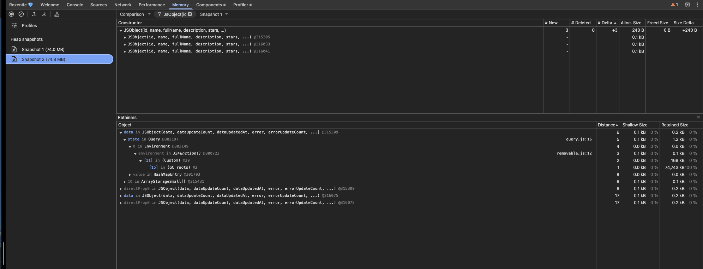
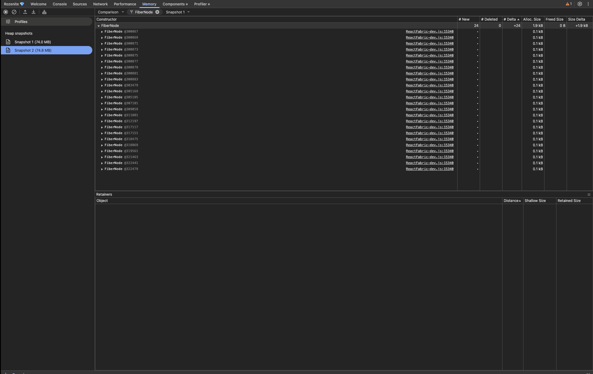

<p align="center">
  
</p>

# GitHub Explorer

Cross-platform React Native app that searches public GitHub repositories. TypeScript, strict mode, feature folders.

Android APK: **[latest GitHub Release](https://github.com/Xadinsx/GitHubExplorer/releases/latest)** (`adb install`).

## Setup

```bash
yarn install
cp .env.example .env
```

Optional: put a GitHub personal access token in `.env` as `GITHUB_TOKEN`. Unauthenticated search is **60 requests/hour**. A token raises that to 5,000 — you will need it for a live demo with typing + infinite scroll.

```bash
yarn android
# or
yarn ios
```

Metro (Rozenite Network Activity on): `yarn start`

Open **React Native DevTools** → **Network Activity** to inspect GitHub `search/repositories` calls (headers, status, timing, bodies). The plugin is a dev dependency and no-ops in production. `WITH_ROZENITE=false yarn react-native start` runs Metro without it.

Tests: `yarn test`

Types: `yarn tsc`

Lint: `yarn lint` (ESLint + Prettier via `eslint-plugin-prettier`). Format: `yarn format`. Format-on-save is pinned in `.vscode/settings.json` to this repo’s Prettier (`printWidth` 120, 2-space indent) so user-level Prettier settings (e.g. width 70) cannot re-wrap files.

Maestro (device/emulator running, app installed):

```bash
maestro test .maestro/search-detail-theme.yaml
```

## Key decisions

**Bare React Native, not Expo.** The brief’s starter is a RN CLI app. TypeScript is now the default template (`npx @react-native-community/cli init`); `react-native-template-typescript` is deprecated. New Architecture + Hermes are on.

**Feature folders + typed API boundary.** `src/features/search` and `src/features/repo-detail` own screens. `src/shared/api/github` owns DTOs, mappers, and errors. TanStack Query is the use-case layer — no ports/DI for two screens.

**TanStack Query + `fetch`.** Cache, request dedupe, retries, `useInfiniteQuery`, and MMKV persistence. Query keys live in one factory so invalidation stays obvious.

**LegendList v3** (`@legendapp/list/react-native`) with `recycleItems` and a `memo` row. No native list code; less blank space on a fast fling than FlatList. The README-facing alternative would be FlashList — we picked LegendList because rows have dynamic height (description wrapping).

**Page size 30, not 100.** The sample URL uses `per_page=100`. One hundred variable-height rows in a single response fights recycling and spends the unauthenticated search quota in one shot. `per_page=30` plus `page` (TanStack `useInfiniteQuery`) keeps the first paint small, flings cheap, and still reaches the same result set.

**Unistyles v3** instead of `StyleSheet` tokens. Themes named `light` / `dark`, adaptive (system) by default, in-app System / Light / Dark persisted in MMKV (`setAdaptiveThemes(false)` when pinning). Styles live in a sibling `*.styles.ts` next to the component — no inline `style={{ }}` and no `StyleSheet.create` inside the TSX.

**ESLint + Prettier.** RN community ESLint is the base (RN 0.87). Prettier (`printWidth` 120, `arrowParens: always`, `trailingComma: es5`). `eslint-plugin-prettier` makes `yarn lint` fail on format drift. Inline styles are an error. Husky + lint-staged run that lint on staged files before each commit (`yarn install` installs the hook).

**`@d11/react-native-fast-image`.** Disk-cached avatars; the d11 fork is the New Architecture–friendly FastImage.

**i18next** with `en` and `pt`. Tests use real `i18n.t('…')` keys — hooks are not mocked.

**Optional `GITHUB_TOKEN`.** 403 + `x-ratelimit-remaining: 0` is a dedicated rate-limit state, not a generic error.

Use **React Native DevTools** for CPU/JS, plus **Rozenite Network Activity** for HTTP. RN DevTools still has no Chrome-style Network panel; this take-home lives or dies on `fetch` (debounce, infinite pages, `x-ratelimit-remaining`, optional `GITHUB_TOKEN`). Rozenite is the Callstack plugin host that adds that panel. We only load `@rozenite/network-activity-plugin`, enable it behind `WITH_ROZENITE=true` on `yarn start`, and skip websocket/SSE inspectors because this client is HTTP GET only.

## Performance

- LegendList only mounts visible rows; `recycleItems` reuses row components on scroll.
- `RepoRow` is `React.memo`; `onPress` is a stable `useCallback`.
- Avatars go through FastImage (HTTP disk cache), not uncached `Image`.
- Search is debounced 400ms and skipped under 2 characters so we do not burn the GitHub quota on every keystroke.
- Query `staleTime` 60s + MMKV persist of successful search pages: the same query can paint from cache. The search box itself starts empty after a cold start.

### Fling / 60 FPS (Flashlight)

Android emulator, **release APK** (`v0.1.0`), search `react-native`, then a 10s fling. [Flashlight](https://docs.flashlight.dev) (Callstack’s recommended metric, not the DevTools Performance tab — that samples JS, not native frames):

<p align="center">
  
</p>

Score **96**. Average **54.7 FPS** over two 10s flings (line holds ~53–57, peak **60**, no drop to 0). High CPU **none**. Average RAM **315 MB** (pages accumulate in the query cache on purpose). Release APK, JS Dev Mode off, Android emulator. A mid-range physical Android would be the next honesty check.

### Network (Rozenite — Flipper’s Network slot)

RN DevTools has no Chrome-style Network panel. We load `@rozenite/network-activity-plugin` in Metro (`yarn start`) so reviewers can see debounce, `per_page=30`, and paging.

<p align="center">
  
</p>

Typing `react-native` produced **one** `GET /search/repositories?q=react-native&per_page=30&page=1` after the 400ms debounce (not one request per letter).

<p align="center">
  
</p>

Scrolling to the end of the first page issued `page=2` only — infinite scroll, not a `per_page=100` dump.

### Memory (RN DevTools heap comparison)

Two Hermes heap snapshots after a fling + opening a repo. ~74 MB is mostly **compiled code** (debug + DevTools), not the list.

<p align="center">
  
</p>

`Repository` objects **+3 / +240 B**, retained by the query cache (expected for extra pages), not unbounded growth.

<p align="center">
  
</p>

`FiberNode` **+26 / +1.9 kB**. Rows are recycled; the React tree does not grow with scroll position.

## APK / Fastlane

Sideload from the **[latest GitHub Release](https://github.com/Xadinsx/GitHubExplorer/releases/latest)**.

Release APKs are `assembleRelease` builds. With upload-keystore secrets in CI they are Play-upload signed; without those secrets they are **debug-signed** so a reviewer can still install them (`adb install`). They are not Play Store artifacts.

Secrets (GitHub Actions / Origin), used when you want an upload-signed APK:

- `KEYSTORE_BASE64`
- `STORE_PASSWORD`
- `KEY_ALIAS`
- `KEY_PASSWORD`

Tag a release:

```bash
git tag v0.1.0
git push origin v0.1.0
```

CI runs `bundle exec fastlane android github_release` (`assembleRelease` + `set_github_release` + APK upload) when the keystore secret is present. If it is missing, the workflow skips Fastlane so the tag stays green — attach a locally built APK with `gh release create` instead.

Locally, after secrets are available as env vars:

```bash
bundle install
bundle exec fastlane android github_release
```

Fallback: `cd android && ./gradlew assembleRelease` (debug-signed if no upload keystore properties are passed).

## Architecture

Feature folders (`src/features/*`), typed GitHub boundary (`src/shared/api/github`), TanStack Query as the use-case layer. Screens keep Unistyles in an adjacent `Component.styles.ts`.

Layout, dependency rules, and **strict file/folder naming**: [`docs/architecture.md`](docs/architecture.md).

## What I would do with more time

- Maestro on CI (`workflow_dispatch` Android emulator), not only local.
- Accessibility pass (Dynamic Type, TalkBack on stats).
- iOS TestFlight lane.
- Query cache eviction UI (“clear offline data”).
- Flashlight on a mid-range physical Android (this capture is an emulator) and in CI.

## License

Public take-home. Source lives at [github.com/Xadinsx/GitHubExplorer](https://github.com/Xadinsx/GitHubExplorer).
